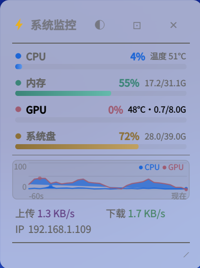
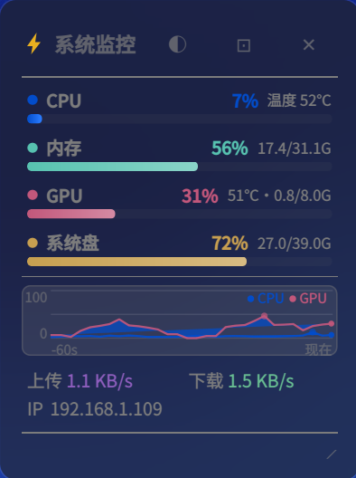

# DeskMon / 桌面监控

Deepin 社区「10亿 Token 奖池，写出属于你的 deepin 桌面插件」活动 · 方向三「DTK 创新原生应用」

基于 **DTK6 / Qt6** 的桌面系统监控小工具（C++17），从 PyQt5 原版迁移。

## 功能

- 右下角无边框悬浮小窗（可拖动 / 右下角调整宽度）
- 双形态：完整悬浮窗 / 单行迷你浮动条，托盘菜单或标题栏 ⊟ 一键切换，切换时自动贴右下角边缘
- CPU / 内存 / GPU / 系统盘：长条进度 + 百分比 + 附加信息（温度/容量），独立配色
- 网络：上/下行速度 + IP
- 系统托盘：显示/隐藏、透明度、设置、退出
- 原生设置面板：透明度滑条、刷新间隔、指标显隐、窗口置顶、开机自启
- 主题自动跟随：指标色由系统活跃色派生，明暗主题自动调亮度
- 单实例：重复启动时激活已有窗口
- 无 NVIDIA 显卡时自动降级隐藏 GPU 面板

## 界面预览

| 浅色主题 | 深色主题 |
| --- | --- |
|  |  |

右下角悬浮监控窗，完整模式展示 CPU / 内存 / GPU / 系统盘指标、60 秒趋势折线、网络速度与 IP。点击标题栏 ⊡ 可收缩为单行迷你浮动条，双击迷你条恢复完整窗口。

## 构建

```bash
# 本机工具链在自定义前缀（Qt 6.8.0 + DTK6 6.7.44），标准系统包环境下可省略 CMAKE_PREFIX_PATH
cmake -S . -B build -DCMAKE_PREFIX_PATH="$HOME/jm-prefix/usr" -DCMAKE_BUILD_TYPE=Debug
cmake --build build -j"$(nproc)"

# 或用快速启动脚本（build/run/clean 三模式）
./start.sh            # 增量编译后启动
./start.sh clean      # 清理后全量编译并启动

# 运行（需要 X 显示）
LD_LIBRARY_PATH="$HOME/jm-prefix/usr/lib/x86_64-linux-gnu:$LD_LIBRARY_PATH" DISPLAY=:0 ./build/deskmon
```

## 打包 / 安装

```bash
# 一键 deb 打包（fakeroot 需关闭 sandbox，故脱离沙箱执行）
dpkg-buildpackage -b -us -uc -d
mkdir -p dist && cp ../deskmon_*.deb dist/

# 安装到系统（apt 会自动解析 Recommends 拉装 nvidia-smi）
sudo apt install ./dist/deskmon_1.0.2_amd64.deb
# 之后从启动器搜「DeskMon / 桌面监控」即可运行

# 卸载（保留 ~/.config/deskmon 用户配置）
sudo apt remove deskmon
```

> **包元数据**：`Installed-Size: 345 KB`（`dpkg-gencontrol` 自动计算）、`Recommends: nvidia-smi`（软依赖，无 N 卡用户可正常安装）、运行依赖由 `dh_shlibdeps` 自动生成（`libdtk6*`、`libqt6*`）。
> 查看占用大小：`dpkg -l deskmon` 或 `apt show deskmon | grep Installed-Size`。

## 环境备忘（jm-prefix 工具链）

首次构建前已在本机完成以下修复（不在仓库内，重装环境需重做）：

1. **DTK6 开发库断链**：`~/jm-prefix/usr/lib/x86_64-linux-gnu/` 下 `libdtk6{core,declarative,gui,log,widget}.so.{6,0}.7.44`
   指向不存在的 6.7.44，已重定向到系统 `/usr/lib/x86_64-linux-gnu/` 的实际 6.7.47。
2. **缺转发头**：`dtk6/DWidget/DObject`、`dtk6/DWidget/DThemeManager` 缺失，已按
   `#include "dobject.h"` / `#include "dthememanager.h"` 格式补齐。
3. **⚠️ DLogManager 破坏事件循环**：`DLogManager::registerConsoleAppender()` 在本环境会替换
   Qt 消息处理器导致 QTimer 不再触发，故全程使用 Qt 原生日志（`qDebug`/`qInfo`），不调用 DLogManager。

## 目录

```
main.cpp                      入口：DApplication + 单实例
src/config.{h,cpp}            配置读写 ~/.config/deskmon/config.json
src/systemmonitor.{h,cpp}     数据层（/proc + sysfs，无需 psutil）
src/nvidia_gpu.{h,cpp}        nvidia-smi 封装 + 降级探测
src/themecolors.{h,cpp}       主题跟随的指标配色
src/settings_dialog.{h,cpp}   原生设置面板（DDialog）
src/monitorwidget.{h,cpp}     主悬浮窗口 + 托盘
src/widgets/metricrow.{h,cpp} 紧凑指标行（点+名称+百分比+细条）
src/widgets/netwidget.{h,cpp} 网络组件（速度+IP）
icons/deskmon.svg             矢量图标
deskmon.desktop               启动器
debian/                       deb 打包源码包（control/rules/changelog/...）
dist/                         构建产物归档（.deb，不入库）
```

## 许可证

GPL-2.0
